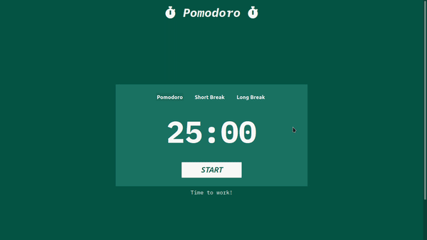
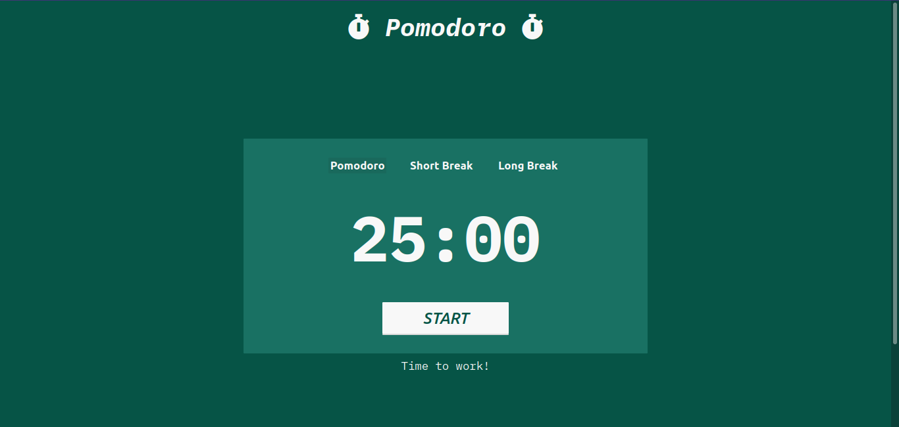
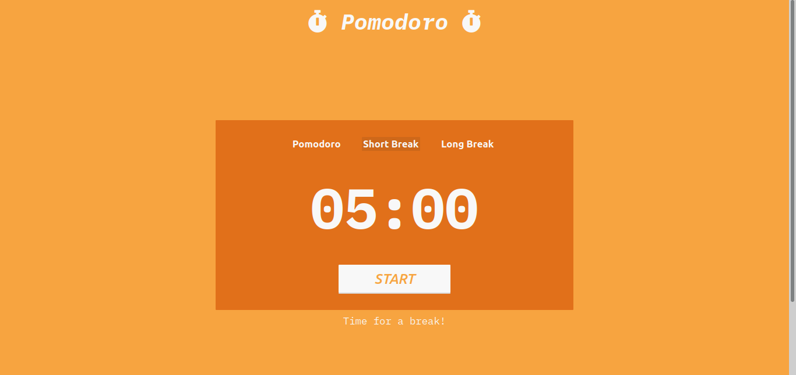
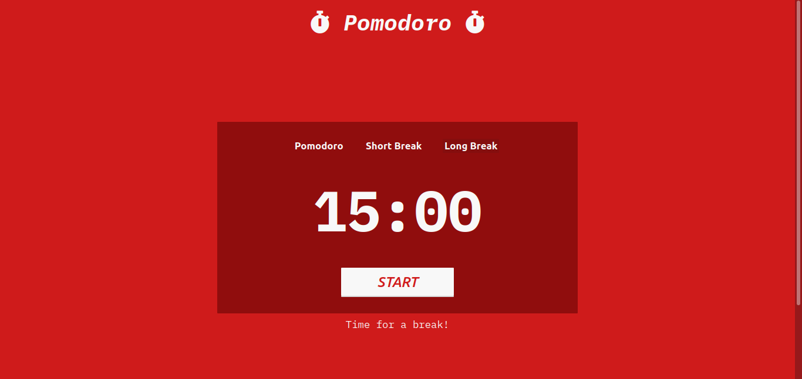
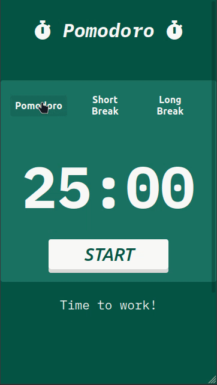
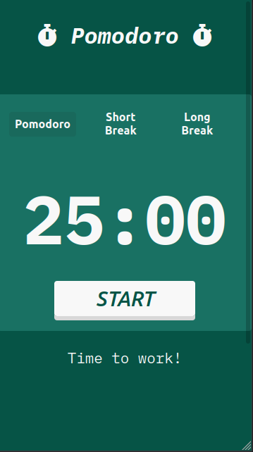
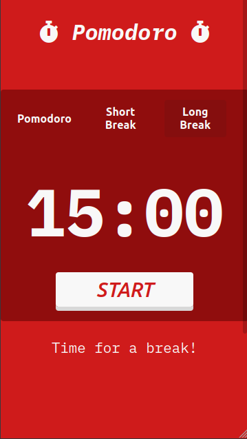

# Pomodoro - App 🍅

### <ins>Sobre o Pomodoro</ins>

- Pomodoro é uma técnica muito utilizada na parte dos estudos/trabalhos. Através dela é possível ter uma linha de foco maior nas atividades que devem ser realizadas.
- Ele possui 3 estágios. Cada estágio possui um tempo padrão(ou pode ser personalizado). Os estagios são: **Pomodoro**, **Short Break** e **Long Break**. Eles possuem um tempo, respectivamente de: *25:00* minutos, *05:00* minutos e *15:00* minutos.
- Geralmente após a conclusão de 4 ciclos de **Pomodoro**, a opção de **Long Break** é ativada, permitindo então, um intervalo de descanso maior.

---

## <ins>O Projeto</ins>

O projeto foi criado tendo como inspiração o **[pomofocus.io](https://pomofocus.io)**.

### Objetivo

O objetivo desse projeto foi tanto <ins>reforçar alguns conhecimentos</ins> de CSS quanto de JavaScript.

> ***O que foi reforçado/aprendido?***

- **CSS**
    - *Position absolute e relative;*
    - *Display flex;*
    - *Media Queries;*

---

- **JavaScript**
    - *setInterval;*
    - *DOM Manipulation;*

---

## <ins>Project Demo</ins>

Para experienciar o projeto de fato, você pode acessar essa URL: https://matheus-lincon.github.io/Pomodoro-App/

### Desktop

    

---

<table>
    <tr>
        <td></td>
        <td></td>
        <td></td>
    </tr>
</table>

---
---

### Mobile

    

---

<table align="center">
    <tr>
        <td></td>
        <td></td>
        <td></td>
    </tr>
</table>

